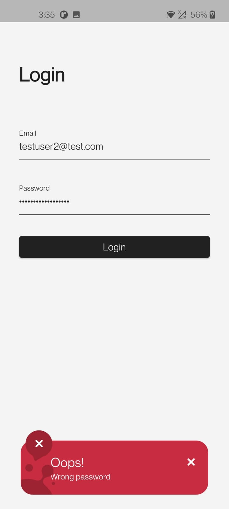
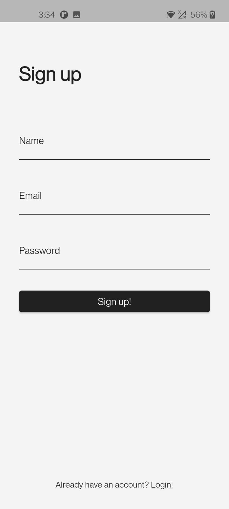
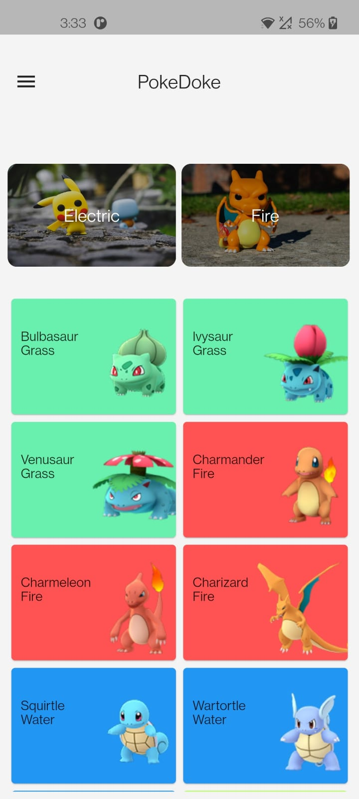
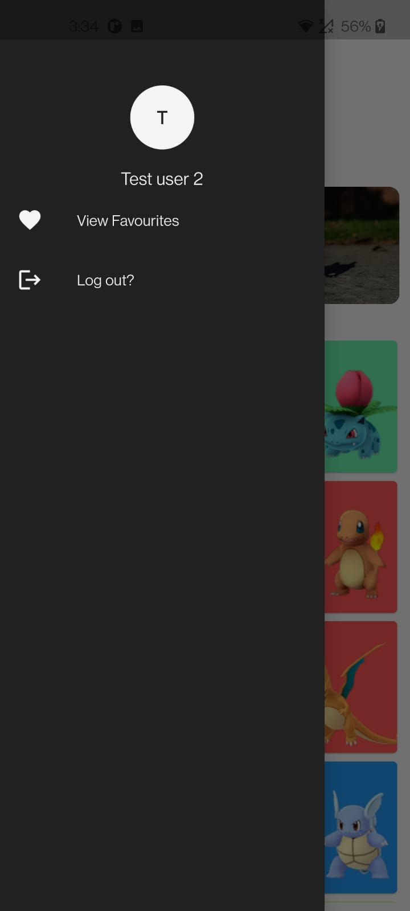
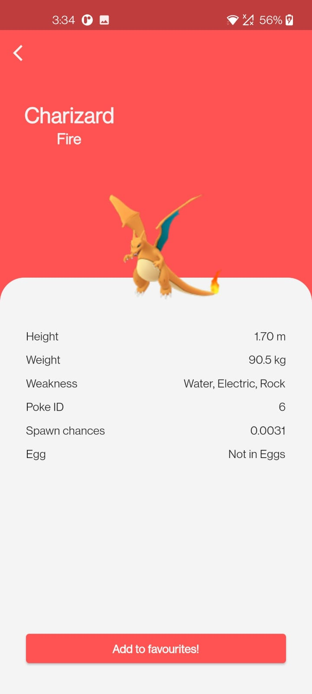
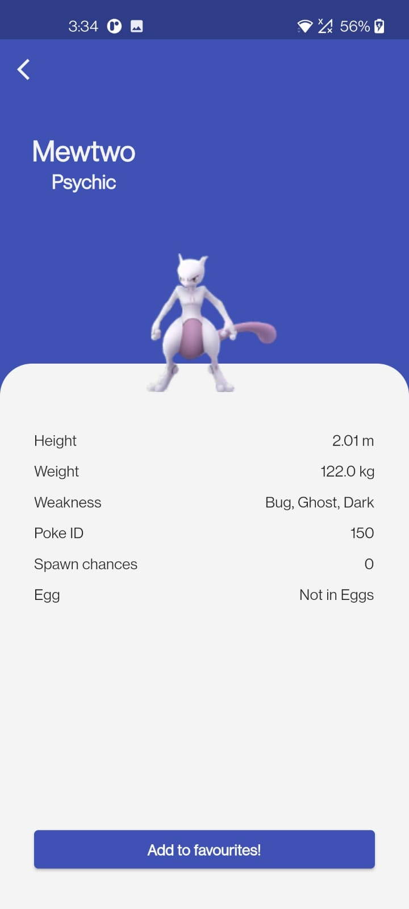
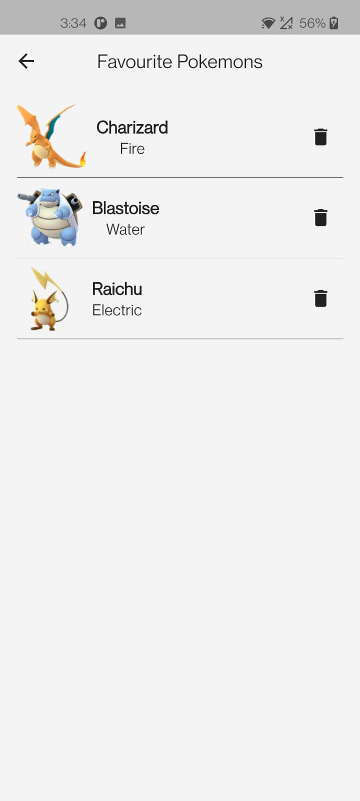

# pokedoke
## Find Pokemons and look up your favourite Pokemons!
Apps a day before mids do no harm.
## Fucntionalities
- Signup
- Login
- View all Pokemons
- View Details of a Pokemon
- Mark Pokemons as favourite
- Remove Pokemons from favourites

## Libraries/Tech stack
- Flutter (Create cool frontend)
- Firebase (An even cooler backend)
- Bloc (Manage state using Blocs)
- Hydrated Bloc (Preserve state in local storage.)
- Awesome Snackbar 
- Flutter From Builder
- Form Builder Validators

## Tasks completed
1. [x] Login via Firebase Auth
2. [x] Manage user properties via Cloud Firestore 
3. [x] Keep users logged in via BloC
4. [x] Generate and validate form fields using Flutter Form Builder
5. [x] Display Pokemons via Poke API
6. [x] Display details of Pokemons
7. [x] Mark Pokemons as favourites
8. [x] Save favourite Pokemons in local storage     

## Screenshots

## UI Inspiration
The user interface has been inspired by the work of Saepul Nawan. Visit his dribbble profile and the work he has done using the following link.
[Saepul Nawan - UI for Pokemon App](https://dribbble.com/shots/6540871-Pokedex-App)